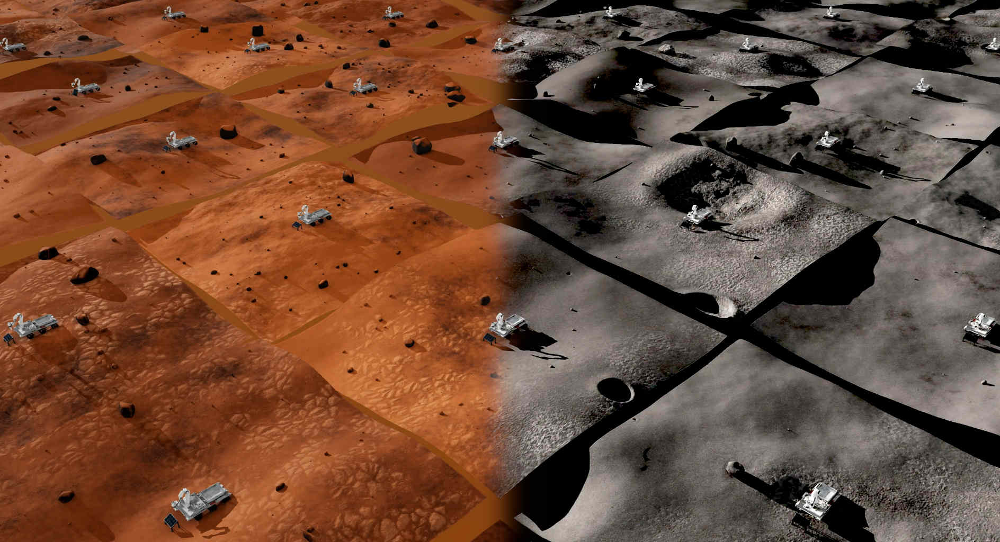

**Space Robotics Bench (SRB)** is a comprehensive collection of environments and tasks for robotics research in the challenging domain of space. It provides a unified framework for developing and validating autonomous systems under diverse extraterrestrial scenarios. At the same time, its design is flexible and extensible to accommodate a variety of development workflows and research directions beyond Earth.

## Key Features

- **Highly Parallelized Simulation via [NVIDIA Isaac Sim](https://developer.nvidia.com/isaac-sim)**: SRB supports thousands of parallel simulation instances to accelerate workflows such as online learning, synthetic dataset generation, parameter tuning, and validation.

- **On-Demand Procedural Generation with [SimForge](https://github.com/AndrejOrsula/simforge)**: Automated procedural generation of simulation assets is leveraged to provide a unique scenario for each simulation instance, with the ultimate goal of developing autonomous systems that are both robust and adaptable to the unpredictable domain of space.

- **Extensive Domain Randomization**: All simulation instances can be further randomized to enhance the generalization of autonomous agents towards variable environment dynamics, visual appearance, illumination conditions, as well as sensor and actuation noise.

- **Compatibility with [Gymnasium API](https://gymnasium.farama.org)**: All tasks are compatible with a standardized API to ensure seamless integration with a broad ecosystem of libraries and frameworks for robot learning research.

- **Seamless Interface with [ROS 2](https://ros.org)**: Simulation states, sensory outputs and actions of autonomous systems are available through ROS 2 middleware interface, enabling a direct interoperability with the vast (Space) ROS ecosystem.

- **Abstract Architecture**: The architecture of SRB is designed to be modular and extensible, allowing for an easy integration of new assets, robots, tasks and workflows

## Table of Contents (available in the left sidebar)

<!-- TODO: Update -->

#### Overview

1. [Environments](envs/index.md)
1. [Robots](robots/index.md)

#### Integrations & Interfaces

3. [ROS 2](integrations/ros2.md)
1. [Reinforcement Learning](integrations/reinforcement_learning.md)
1. Imitation Learning
1. Extended Reality

#### Getting Started

7. [System Requirements](getting_started/requirements.md)
1. [Installation](getting_started/install.md)
1. [Basic Usage](getting_started/basic_usage.md)

#### Instructions

10. [Command Line Interface](instructions/cli.md)
01. [Graphical User Interface](instructions/gui.md)
01. [Workflows](instructions/workflows.md)

#### Configuration

13. [Environment Configuration](config/env_cfg.md)
01. [Agent Configuration](config/agent_cfg.md)

#### Development

15. [IDE Configuration](development/ide.md)
01. [Dev Container](development/devcontainer.md)
01. [Development Utilities](development/utilities.md)

#### Contributing

18. [New Assets](contributing/new_assets.md)
01. [New Robots](contributing/new_robots.md)
01. [New Tasks](contributing/new_tasks.md)

#### Miscellaneous

- [Attributions](misc/attributions.md)
- [Contributors](misc/contributors.md)
- [Citation](misc/citation.md)
- [Troubleshooting](misc/troubleshooting.md)
