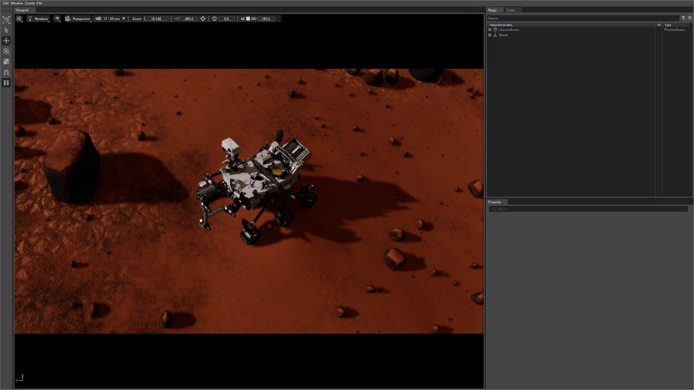

# Basic Usage

After successful [installation](./install.md), you're ready to explore Space Robotics Bench. This guide covers the essential operations to get you started.

<div class="warning">
Throughout this documentation:

- Commands prefixed with <code>.docker/run.bash</code> are for Docker users
- Commands without this prefix assume you're either:
  1. Already inside the Docker container, or
  1. Using a native installation

Docker users should always use the provided <a href="https://github.com/AndrejOrsula/space_robotics_bench/blob/main/.docker/run.bash"><code>.docker/run.bash</code></a> script as it configures the environment correctly.

</div>

## Initial Verification

First, verify that Isaac Sim works correctly on your system:

```bash
# For Docker users (single quotes preserve tilde expansion)
.docker/run.bash '~/isaac-sim/isaac-sim.sh'

# For native installation
~/isaac-sim/isaac-sim.sh
```

<div class="warning">
The first Isaac Sim launch may take several minutes while shaders compile. Subsequent launches will be significantly faster.
</div>

If Isaac Sim launches successfully, you're ready to continue. If not, check the [Troubleshooting](../misc/troubleshooting.md) section.

## Controlling a Rover

Let's start with the Perseverance rover on Mars:

```bash
# For Docker users
.docker/run.bash scripts/teleop.py --env perseverance

# For native installation
python scripts/teleop.py --env perseverance
```

After initialization (which may take longer on first run), you'll see the rover in a Martian landscape:



### Control Scheme

The terminal displays these controls:

```
+------------------------------------------------+
|  Keyboard Scheme (focus the Isaac Sim window)  |
+------------------------------------------------+
+------------------------------------------------+
| Reset: [ L ]                                   |
+------------------------------------------------+
| Planar Motion                                  |
|                     [ W ] (+X)                 |
|                       ↑                        |
|                       |                        |
|          (-Y) [ A ] ← + → [ D ] (+Y)           |
|                       |                        |
|                       ↓                        |
|                     [ S ] (-X)                 |
+------------------------------------------------+
```

To control the rover:

1. **Make sure the Isaac Sim window is in focus**
1. Use `W`/`A`/`S`/`D` keys for movement
1. Use mouse to control the camera view
1. Press `L` to reset if the rover gets stuck
1. Press `Ctrl+C` in the terminal to exit

## Enhancing Your Experience

### Improving Visual Quality

The default settings use 50% texture resolution for performance. For better visuals on capable hardware:

```bash
# For Docker users
.docker/run.bash -e SRB_DETAIL=1.0 scripts/teleop.py --env perseverance

# For native installation
SRB_DETAIL=1.0 python scripts/teleop.py --env perseverance
```

### Performance Optimization

If you experience lag:

```bash
# Use lower detail for better performance
.docker/run.bash -e SRB_DETAIL=0.25 scripts/teleop.py --env perseverance
```

## Exploring Available Environments

Space Robotics Bench features multiple environments. List them with:

```bash
# For Docker users
.docker/run.bash scripts/list_envs.py

# For native installation
python scripts/list_envs.py
```

### Try Different Environments

```bash
# Ingenuity helicopter on Mars
.docker/run.bash scripts/teleop.py --env ingenuity

# Curiosity rover
.docker/run.bash scripts/teleop.py --env curiosity

# Dragonfly on Titan
.docker/run.bash scripts/teleop.py --env dragonfly

# Europa underwater exploration
.docker/run.bash scripts/teleop.py --env europa_sub
```

Each environment provides different challenges and terrains, showcasing the versatility of the Space Robotics Bench platform.

For a complete overview of available environments and their features, see the [Environment Documentation](../overview/envs/index.html).
